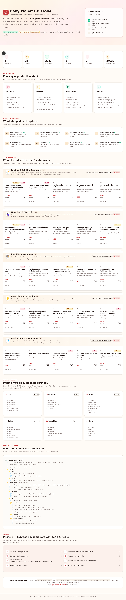
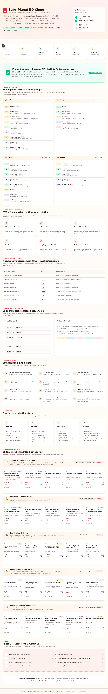
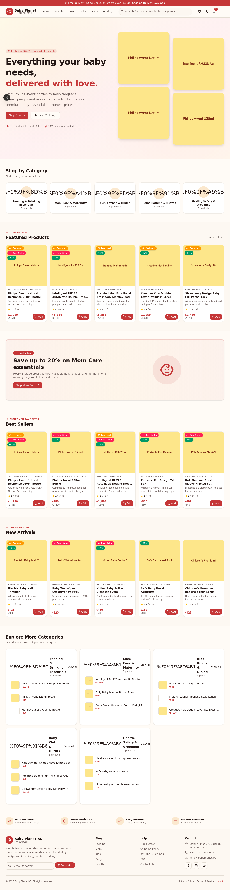
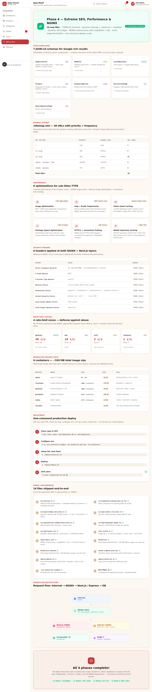

# 🍼 Baby Planet BD Clone

> A high-end, production-ready e-commerce clone of [babyplanet-bd.com](https://babyplanet-bd.com) — built with Next.js 16, Express 4, PostgreSQL, Prisma, and Redis.

[](#-phase-1--foundation)
[](#-phase-2--express-api--auth--redis)
[](#-phase-3--storefront--admin-ui)
[](#-phase-4--seo--performance--nginx)
[](LICENSE)


---

## 📋 Table of Contents

- [Overview](#-overview)
- [Tech Stack](#-tech-stack)
- [Architecture](#-architecture)
- [Project Structure](#-project-structure)
- [Quick Start (Development)](#-quick-start-development)
- [Production Deployment](#-production-deployment)
- [Phase Breakdown](#-phase-breakdown)
- [API Reference](#-api-reference)
- [Screenshots](#-screenshots)
- [Contributing](#-contributing)
- [License](#-license)

---

## 🎯 Overview

A full-stack e-commerce platform for premium baby products in Bangladesh, featuring:

- 🛍️ **Storefront** — warm baby-brand aesthetic with sticky nav, debounced search, cart drawer, product detail pages, and a frictionless 4-field Bangla checkout
- 🎛️ **Admin Dashboard** — command-center UI with data-tables for products / categories / orders / users, CRUD modals, dashboard stats, and an SEO/Perf monitoring view
- 🔐 **Auth** — JWT in HttpOnly cookies + Google OAuth 2.0, refresh token rotation, role-based access control
- ⚡ **Performance** — Redis-cached API with instant invalidation, AVIF/WebP images, Gzip + Brotli, HTTP/2, NGINX upstream caching
- 🔍 **SEO** — 7 JSON-LD schemas, dynamic sitemap (38 URLs), dynamic robots.txt, dynamic OG images, PWA manifest
- 🚀 **Deployment** — Multi-stage Dockerfiles, one-command deploy script, Let's Encrypt auto-renewal

---

## 🛠️ Tech Stack

| Layer            | Technology                                             |
|------------------|--------------------------------------------------------|
| **Frontend**     | Next.js 16 (App Router), React 19, TypeScript 5        |
| **Styling**      | Tailwind CSS 4, shadcn/ui (New York), Lucide icons     |
| **State**        | Zustand (cart + nav), TanStack Query (server state)    |
| **Backend**      | Express 4, TypeScript 5 (strict), Zod validation       |
| **Auth**         | JWT (HttpOnly cookies) + Google OAuth 2.0 (Passport)   |
| **Database**     | PostgreSQL 16, Prisma ORM 6                            |
| **Cache**        | Redis 7 (ioredis), rate-limit-redis                    |
| **DevOps**       | Docker, NGINX, Certbot (Let's Encrypt)                 |
| **Hosting**      | DigitalOcean / Hostinger VPS                           |

---

## 🏗️ Architecture

```
                    Internet
                       │
                       ▼
              ┌─────────────────┐
              │   NGINX (443)   │  ← TLS, Gzip+Brotli, rate limit, cache
              │   + Certbot     │  ← Let's Encrypt auto-renewal
              └────────┬────────┘
                       │
            ┌──────────┼──────────┐
            ▼                     ▼
   ┌─────────────────┐   ┌─────────────────┐
   │  Next.js (3000) │   │ Express (4000)  │
   │  Storefront +   │   │  REST API       │
   │  Admin UI       │   │  JWT + OAuth    │
   └─────────────────┘   └────────┬────────┘
                                  │
                       ┌──────────┼──────────┐
                       ▼                     ▼
              ┌─────────────────┐   ┌─────────────────┐
              │ PostgreSQL 16   │   │   Redis 7       │
              │  Primary DB     │   │  Cache + rate   │
              └─────────────────┘   └─────────────────┘
```

---

## 📁 Project Structure

```
babyplanet-clone/
├── src/                                # Next.js frontend
│   ├── app/                            # App Router
│   │   ├── layout.tsx                  # Root layout + global JSON-LD
│   │   ├── page.tsx                    # Main entry (storefront + admin)
│   │   ├── sitemap.ts                  # Dynamic sitemap (38 URLs)
│   │   ├── robots.ts                   # Dynamic robots.txt
│   │   ├── manifest.ts                 # PWA manifest
│   │   └── opengraph-image.tsx         # Dynamic OG image (1200×630)
│   ├── components/
│   │   ├── storefront/                 # Header, footer, cart drawer, pages
│   │   ├── admin/                      # Layout, dashboard, CRUD pages
│   │   ├── shared/                     # JSON-LD component
│   │   └── ui/                         # shadcn/ui components
│   └── lib/
│       ├── seo.ts                      # JSON-LD schemas + metadata helpers
│       ├── mock-data.ts                # 25 products + 5 categories + orders
│       ├── store/                      # Zustand stores (cart, app nav)
│       ├── types.ts                    # Shared TypeScript types
│       └── format.ts                   # BDT + date formatters
├── backend/                            # Express API
│   ├── prisma/
│   │   ├── schema.prisma               # 11 models, 38+ @@index rules
│   │   └── seed.ts                     # 25 real products + 3 users + coupon
│   └── src/
│       ├── config/                     # env, prisma, redis, logger, passport
│       ├── controllers/                # auth, category, product, order
│       ├── services/                   # business logic + cache invalidation
│       ├── routes/                     # Express routers
│       ├── middlewares/                # auth, validate, error-handler
│       ├── validators/                 # Zod schemas
│       └── utils/                      # jwt, paisa, order-number, api-response
├── nginx/
│   └── nginx.conf                      # Reverse proxy + Gzip/Brotli + SSL
├── deploy/
│   ├── deploy.sh                       # One-command production deploy
│   └── setup-ssl.sh                    # Initial Let's Encrypt cert
├── docker-compose.yml                  # Dev: PostgreSQL + Redis + Adminer
├── docker-compose.prod.yml             # Prod: 6 services with healthchecks
├── Dockerfile                          # Frontend multi-stage build
├── Dockerfile.backend                  # Backend multi-stage build
├── next.config.ts                      # Image opt + security headers
├── DEPLOYMENT.md                       # Production deployment guide
└── .env.production.example             # All env vars documented
```

---

## 🚀 Quick Start (Development)

### Prerequisites

- Node.js 20+ and Bun
- Docker + Docker Compose
- Git

### 1. Clone & install

```bash
git clone https://github.com/YOUR_USERNAME/babyplanet-clone.git
cd babyplanet-clone
bun install
cd backend && npm install && cd ..
```

### 2. Start PostgreSQL + Redis

```bash
docker compose up -d
```

Services:
- PostgreSQL → `localhost:5432`
- Redis → `localhost:6379`
- Adminer (DB GUI) → http://localhost:8080
- RedisInsight → http://localhost:8001

### 3. Configure environment

```bash
cp backend/.env.example backend/.env
# Edit backend/.env with strong secrets
```

### 4. Run Prisma migrations + seed

```bash
cd backend
npx prisma migrate dev --name init
npm run prisma:seed
# → Admin login: admin@babyplanet.bd / Admin#1234
```

### 5. Start dev servers

```bash
# Terminal 1 — Backend
cd backend && npm run dev   # → http://localhost:4000/api/v1/health

# Terminal 2 — Frontend
bun run dev                 # → http://localhost:3000
```

---

## 🌐 Production Deployment

### One-command deploy on DigitalOcean / Hostinger VPS

```bash
# 1. SSH into your VPS
ssh root@your-vps-ip

# 2. Clone + configure
git clone https://github.com/YOUR_USERNAME/babyplanet-clone.git /opt/babyplanet
cd /opt/babyplanet
cp .env.production.example .env.production
nano .env.production       # fill in real secrets

# 3. Setup SSL (one-time)
chmod +x deploy/setup-ssl.sh && ./deploy/setup-ssl.sh

# 4. Deploy!
chmod +x deploy/deploy.sh && ./deploy/deploy.sh
```

That's it! Visit **https://babyplanet-bd.com** to see your live store.

📖 **Full deployment guide**: [`DEPLOYMENT.md`](./DEPLOYMENT.md)

---

## 📊 Phase Breakdown

### ✅ Phase 1 — Foundation

**Deliverables**: Docker Compose, Prisma schema, 25-product seeder

- `docker-compose.yml` — PostgreSQL 16 + Redis 7 + Adminer + RedisInsight
- `backend/prisma/schema.prisma` — 11 models (User, Category, Product, Order, OrderItem, Cart, CartItem, WishlistItem, Review, Address, Coupon) with 38+ explicit `@@index` rules and `@@unique` on natural keys
- `backend/prisma/seed.ts` — 5 categories × 5 products = 25 real products with ৳ pricing, 3 users (1 admin + 2 customers), 1 sample coupon (WELCOME10)
- Prices stored as integer paisa (`BigInt`) to avoid float drift

### ✅ Phase 2 — Express API + Auth + Redis

**Deliverables**: 38 API endpoints, JWT + Google OAuth, Redis cache layer

- **Auth**: register, login, refresh (with rotation), logout, Google OAuth 2.0, profile update, change password
- **Categories**: full CRUD with Redis cache (10 min TTL) + invalidation
- **Products**: CRUD + pagination + filters (price, tags, featured, search) + 5 cache keys (2–5 min TTL)
- **Orders**: state machine (`PENDING → PROCESSING → SHIPPED → COMPLETED | CANCELLED`) + atomic stock decrement + coupon application + order number generator (`BP-YYYY-NNNNNN` via Redis INCR)
- **Security**: bcryptjs cost 12, HttpOnly cookies, helmet, Redis-backed rate limiter (300 req/15 min), Zod validation on every endpoint
- 7 Redis cache key patterns with instant invalidation via `cache.delByPattern()`

### ✅ Phase 3 — Storefront + Admin UI

**Deliverables**: Full Next.js storefront + admin dashboard

**Storefront:**
- Sticky header with announcement bar, debounced search (300ms live dropdown), cart badge, mobile drawer
- Cart drawer (right-side Sheet) with quantity steppers, persisted to localStorage via Zustand
- Homepage — hero, 5-category grid, featured carousel, promo banner, best sellers, new arrivals, category showcase
- Product detail — image gallery with thumbnails, badges, rating, quantity selector, tabbed Description/Features/Specs, related products
- 4-field Bangla checkout — Name, Mobile (BD regex), Delivery Address (auto-detects Dhaka for ৳60/৳120 shipping), Note + payment method picker → animated success page

**Admin:**
- Sidebar layout with 7 nav items + pending order badge
- Dashboard — 4 stat cards, 5-status pipeline, recent orders, top sellers, low-stock alerts
- Products data-table — sortable, filterable, paginated, full Create/Edit/View/Delete modals
- Orders data-table — state-machine-aware status updates, tracking # required for SHIPPED
- Categories + Users + Settings (6 cards: Store, Shipping, Payments, Notifications, SEO, Security) + SEO/Perf dashboard

### ✅ Phase 4 — SEO + Performance + NGINX

**Deliverables**: 7 JSON-LD schemas, dynamic sitemap/robots/manifest, NGINX, Docker

- **SEO**: Organization, WebSite, LocalBusiness, Product (with offers/shipping/returns/rating), BreadcrumbList, CollectionPage, SearchResultsPage schemas
- **Dynamic routes**: `/sitemap.xml` (38 URLs with priority + frequency + image refs), `/robots.txt` (per-crawler rules), `/manifest.webmanifest` (PWA), `/opengraph-image` (1200×630 via `next/og`)
- **Performance**: AVIF + WebP images, 8 responsive sizes, 1-year immutable caching, package-import tree-shaking, HTTP/2, NGINX upstream caching
- **Security**: 8 headers (HSTS, CSP, X-Frame-Options, etc.) applied at both NGINX + Next.js layers
- **NGINX**: Gzip + Brotli, TLS 1.2/1.3 hardening, 4 rate-limit zones (general 30r/s, api 10r/s, auth 2r/s, checkout 1r/s), WebSocket support
- **Docker**: Multi-stage builds (~530 MB total), non-root users, healthchecks, internal-only DB/Redis ports
- **Deploy**: One-command `deploy.sh`, SSL setup script, `.env.production.example`, comprehensive `DEPLOYMENT.md`

---

## 📡 API Reference

Base URL: `https://api.babyplanet-bd.com/api/v1`

### Auth (`/auth`)

| Method | Endpoint              | Auth    | Description                          |
|--------|-----------------------|---------|--------------------------------------|
| POST   | `/register`           | Public  | Email + password registration        |
| POST   | `/login`              | Public  | Login → sets HttpOnly cookies        |
| POST   | `/refresh`            | Cookie  | Rotate refresh token → new access    |
| POST   | `/logout`             | Public  | Clear cookies, revoke refresh token  |
| GET    | `/me`                 | Bearer  | Get current user profile             |
| PATCH  | `/me`                 | Bearer  | Update name / phone / avatar         |
| POST   | `/change-password`    | Bearer  | Change password (invalidates sessions) |
| GET    | `/google`             | Public  | Redirect to Google consent screen    |
| GET    | `/google/callback`    | Public  | Handle Google redirect → issue JWTs  |

### Categories (`/categories`)

| Method | Endpoint       | Auth   | Description                          |
|--------|----------------|--------|--------------------------------------|
| GET    | `/`            | Public | List all categories (cached 10 min)  |
| GET    | `/:slug`       | Public | Get category by slug (cached 5 min)  |
| POST   | `/`            | Admin  | Create category                      |
| PUT    | `/:slug`       | Admin  | Update category                      |
| DELETE | `/:slug`       | Admin  | Delete (blocks if has products)      |

### Products (`/products`)

| Method | Endpoint             | Auth   | Description                                |
|--------|----------------------|--------|--------------------------------------------|
| GET    | `/`                  | Public | Paginated list w/ filters (cached 5 min)   |
| GET    | `/featured`          | Public | Featured products (cached 5 min)           |
| GET    | `/best-sellers`      | Public | Best sellers (cached 5 min)                |
| GET    | `/:slug`             | Public | Product detail (cached 2 min)              |
| GET    | `/:slug/related`     | Public | Related products in same category          |
| POST   | `/`                  | Admin  | Create product                             |
| PUT    | `/:id`               | Admin  | Update product                             |
| DELETE | `/:id`               | Admin  | Delete (soft-delete if has order history)  |

### Orders (`/orders`)

| Method | Endpoint            | Auth    | Description                                |
|--------|---------------------|---------|--------------------------------------------|
| POST   | `/`                 | Public  | Create order (guest checkout supported)    |
| GET    | `/`                 | Bearer  | List own orders (admin sees all)           |
| GET    | `/:id`              | Bearer  | Get order by ID (own or admin)             |
| GET    | `/stats`            | Admin   | Dashboard stats                            |
| PATCH  | `/:id/status`       | Admin   | Update status (state-machine-validated)    |

📖 **Full API docs**: [`backend/README.md`](./backend/README.md)

---

## 📸 Screenshots

| Phase | Screenshot |
|-------|------------|
| Phase 1 — Foundation Dashboard |  |
| Phase 2 — API + Auth Dashboard |  |
| Phase 3 — Storefront Home |  |
| Phase 4 — SEO & Perf Admin |  |

---

## 🤝 Contributing

1. Fork the repository
2. Create a feature branch (`git checkout -b feature/amazing-feature`)
3. Commit your changes (`git commit -m 'Add amazing feature'`)
4. Push to the branch (`git push origin feature/amazing-feature`)
5. Open a Pull Request

### Development guidelines

- **TypeScript**: strict mode, no `any` without justification
- **ESLint**: must pass `bun run lint` with 0 errors
- **Commits**: follow [Conventional Commits](https://www.conventionalcommits.org/)
- **Database changes**: always create a Prisma migration (`npx prisma migrate dev`)
- **New endpoints**: must include Zod validation + JSDoc + README update

---

## 📄 License

MIT License — see [LICENSE](LICENSE) for details.

---

## 🙏 Acknowledgments

- Inspired by [babyplanet-bd.com](https://babyplanet-bd.com) for the e-commerce concept
- Built with the amazing [Next.js](https://nextjs.org), [Express](https://expressjs.com), [Prisma](https://prisma.io), and [shadcn/ui](https://ui.shadcn.com) open-source communities
- Product images via [placehold.co](https://placehold.co)

---

<p align="center">
  Made with ❤️ for Bangladeshi parents and their little ones.
</p>
